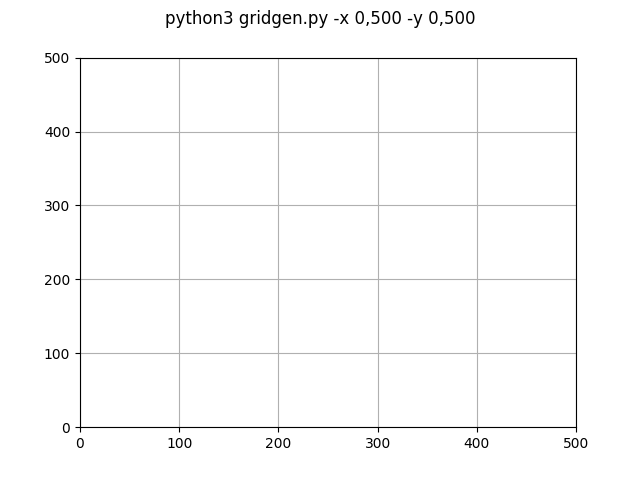
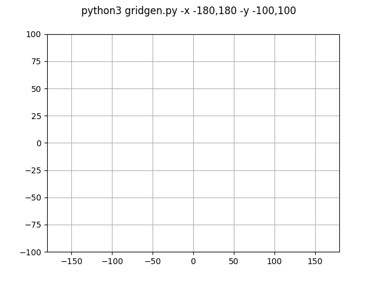
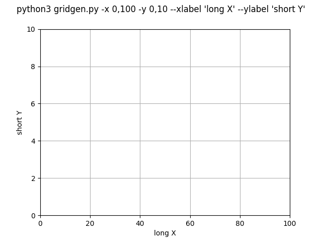

# py-gridgen
Python grid generator using matplotlib

This is a quick and easy way to generate a grid and save it to a local file.

## setup
Install the required libs from *requirements.txt*

`python3 -m pip install -r requiremnts.txt`

## options
| option | example | message |
| ------ | ------- | ------- |
| -o, --output | test.pdf | output filename, if not specified, output will show on screen |
| -x, --xaxis | 0,500 | min and max for x-axis comma delimited |
| -y, --yaxis | 0,500 | min and max for y-axis comma delimited |
| --xlabel | "my x-axis" | set the label for the x-axis |
| --ylabel | "my y-axis" | set the label for the y-axis |
| --title | "My Grid" | add a centered title to the grid | 

### output filetype
The type of the output file is infereed from the extension of the output filename. At this time the following output filetypes are...

|extension|description|
|---|---|
|.ps | postscript
|.eps | encapsulated postscript
|.pdf | portable document format
|.pgf | PGF code for LaTex
|.png|portable network graphics
|.raw|raw RGBA bitmap
|.rgba|raw RGBA bitmap
|.svg|scalable vector graphics
|.svgz|scalable vector graphics
|.jpg|joint photographic experts group
|.jpeg|joing photographic experts group
|.tif|tagged image file format
|.tiff|tagged image file format

## example output

